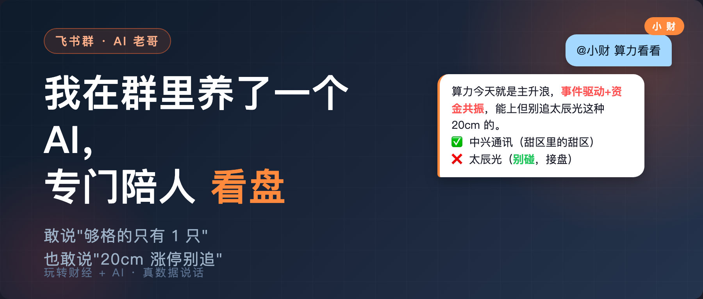
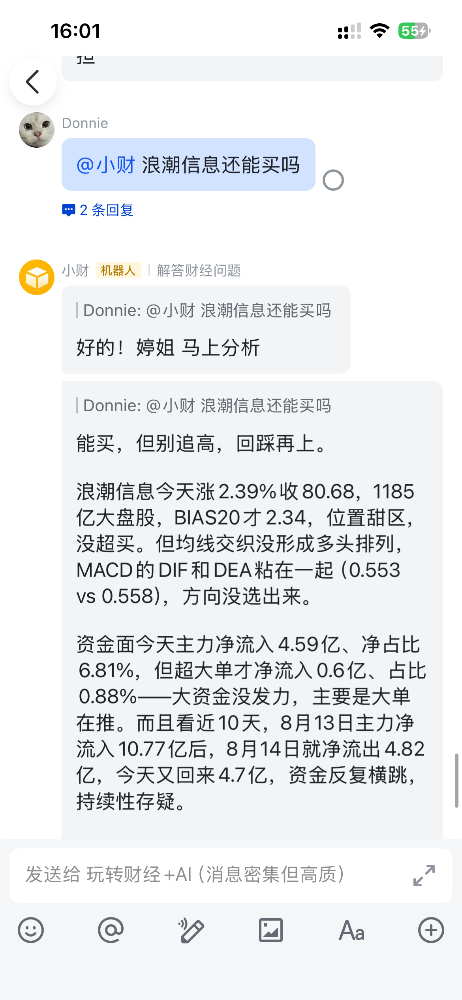
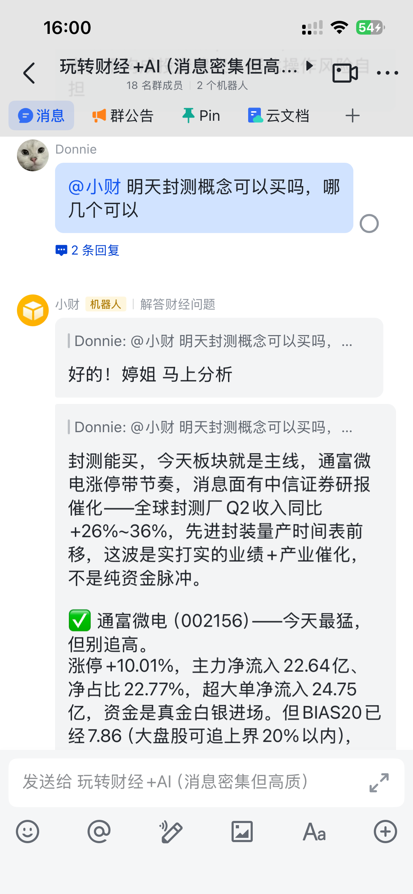
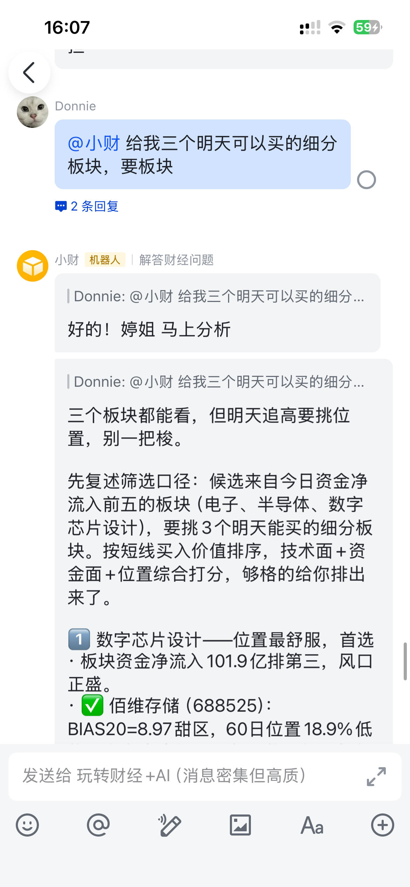
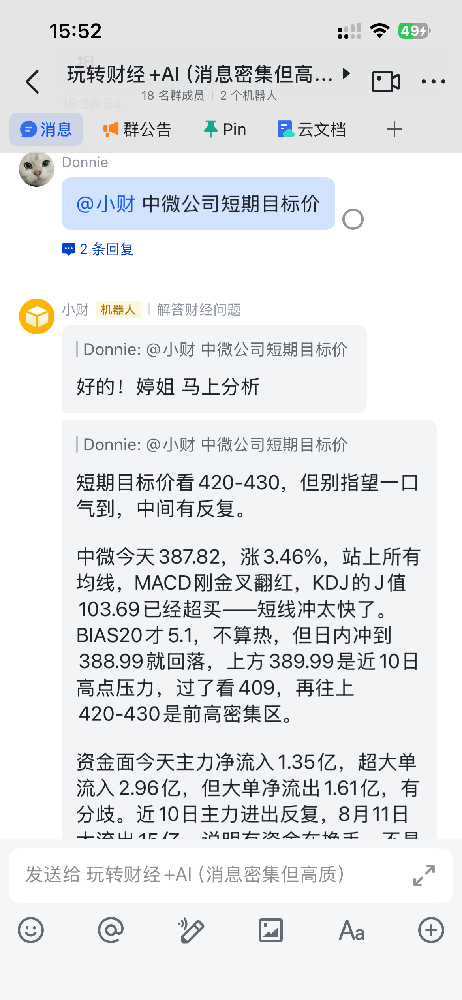
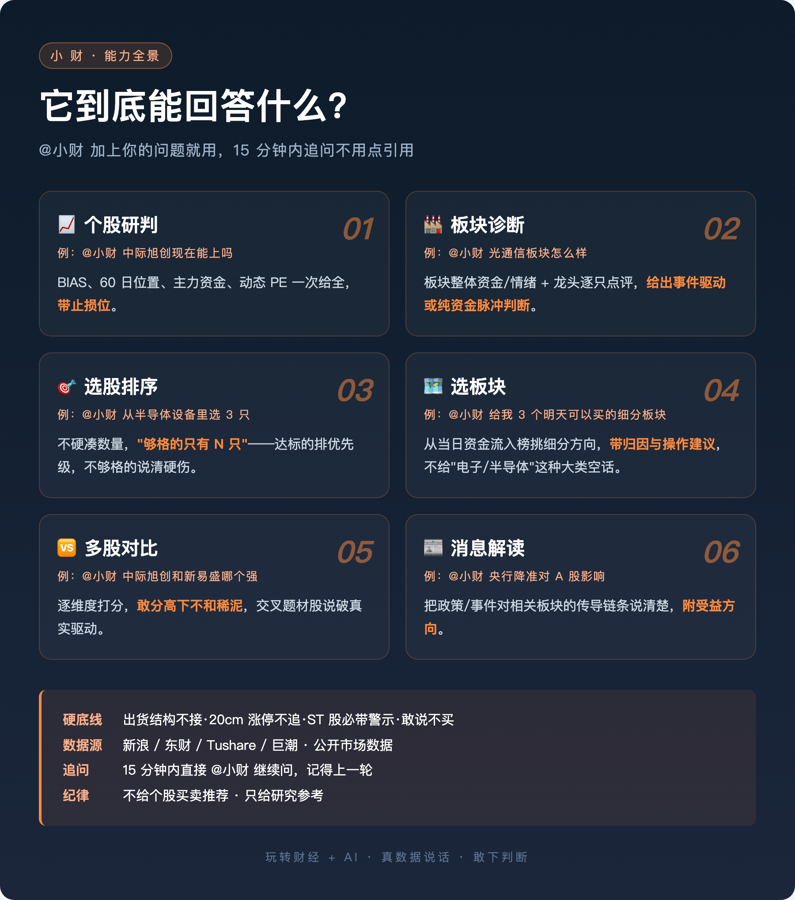

<div align="center">



# xiaocai-stock-ai

**一套开源的 A 股问答引擎 · 用真数据说话 · 敢下判断**

数据取证 + 消息面归因 + 分析策略 + 硬底线 · 让任何人 30 分钟搭出自己的股票分析机器人

[](LICENSE)
[](https://www.python.org/)
[](Dockerfile)
[](serve_mcp.py)

⭐ 觉得有用请给个 Star · 👉 加入讨论群一起玩(见下方)

</div>

---

## 它长这样

问一只股票, 它这么答:



问一个板块, 它这么答:



让它选 3 个板块, 它这么答:



追问不用点引用, 15 分钟内直接接着问, 它记得上一轮:



---

## 它凭什么这么答

四件事让它跟"再问一次通用 AI"不一样。

**① 拿真数据不是从记忆里翻** — 数据来自新浪 / 东财 / Tushare 等公开市场接口, 盘中问就是当天当分钟的资金流、技术面、行情、公告, 不是"根据我的训练数据"。

**② 消息面归因: 事件驱动 vs 纯资金脉冲** — 分析一个板块或个股上涨时, 引擎会自动检索近 3 天相关消息面, 判断这波是"业绩/政策/大单事件驱动"还是"纯资金抱团脉冲"——**前者持续性强, 后者追高就是接盘**。这个判断决定了操作建议的方向, 是别的 AI 给不了的。

**③ 分析框架是代码算好的, 不是模型即兴发挥** — BIAS20 是否在甜区、60 日位置多少、主力资金净流入几个亿、动态 PE vs TTM 反映业绩趋势——这些**判断标准是量化引擎的确定值**, 交给 LLM 只负责组织成话。所以换 LLM 供应商不影响判断质量。

**④ 有硬底线** — 放量出货结构不接、20cm 涨停不追、ST 股必带警示。**"买入/卖出/目标价"字眼引擎输出前自动改写**(`core/compliance.py`, 有 pytest 覆盖)。



---

## ⚡ 30 秒免部署试用

在浏览器打开 [xiaocai.sque.site](https://xiaocai.sque.site), 输入 "中际旭创能上吗", 15 秒后你会看到一段完整分析。

或者用命令行:

```bash
curl -X POST https://xiaocai.sque.site/api/ask \
  -H "Content-Type: application/json" \
  -d '{"question": "中际旭创能上吗"}'
```

**你会看到**: 返回一段带 BIAS、主力资金、操作建议、止损位的分析(约 500-1500 字)。

演示服务限流: 每 IP 每天 20 次、每分钟 3 次。想深度用请看下方"接入方式"。

---

## 📊 我该用哪种接入方式?

看你要在哪里用小财, 选一条路径:

| 我是这种用户 | 我该用 | 大概花多久 |
|---|---|---|
| 用 Claude Desktop / Cursor / Continue | **MCP Server** | 3 分钟改配置 → [手把手教程](docs/tutorials/mcp.md) |
| 用 Claude Code | **CC Skill** | 30 秒 clone → [手把手教程](docs/tutorials/cc-skill.md) |
| 想接进飞书群, 群友 @ 就能用 | **飞书 bot 模板** | 30 分钟 → [手把手教程](docs/tutorials/feishu-bot.md) |
| 想接进 Coze / 扣子 / Kimi 智能体 | **HTTP API + OpenAPI** | 15 分钟 → [手把手教程](docs/tutorials/coze-kimi.md) |
| 自己写 Python agent | **HTTP API** | 5 分钟 → [手把手教程](docs/tutorials/python-sdk.md) |
| 想自己部署一整套服务 | **Docker** | 5 分钟 → [手把手教程](docs/tutorials/self-deploy.md) |

**每份教程都是手把手写的**: 每步都告诉你"应该看到什么"、"没看到该怎么办", 假设你不熟悉命令行也能跟着做。

---

## 项目结构

```
xiaocai-stock-ai/
├── core/                    引擎(数据+策略+人设默认版, 单一实现)
├── serve_http.py            HTTP API 服务
├── serve_mcp.py             MCP Server
├── skill/                   Claude Code Skill 包
├── examples/                4 种接入示例代码
│   ├── feishu-bot/
│   ├── coze-plugin/
│   ├── kimi-agent/
│   ├── wechat-bot/
│   └── openapi.yaml
├── docs/
│   ├── tutorials/           手把手教程(6 份)
│   ├── DEPLOY.md            生产部署方案
│   └── img/                 截图与图卡
├── docker-compose.yml       一键起服务
└── LICENSE                  Apache 2.0
```

---

## 🤝 一起玩

**飞书讨论群** — 项目问题反馈 + 用户交流 + 每天真实群问答可看:


**群链接**: https://applink.feishu.cn/client/chat/chatter/add_by_link?link_token=ed4vc1d6-24a8-4c30-b149-4d16882f54d2

群名不可搜索, 扫码或链接进。进群后 @小财 就能用同一套引擎问问题。

---

## 硬底线与免责

**引擎自带的硬约束**(引擎输出前统一走 `core/compliance.py` 清洗, 参见 [tests/test_compliance.py](tests/test_compliance.py)):

- **BASE 层(默认开)**: "买入"→"看好", "卖出"→"看淡", "看涨"→"偏强", "看跌"→"偏弱", "目标价"→"参考区间", "暴涨/大涨"→"上涨", 内部工具名/调用失败字眼句子级删除
- **STRICT 层(env `XIAOCAI_STRICT_COMPLIANCE=1` 开)**: 删股票代码 + 带符号涨跌幅 + "上涨超8%"→"上涨"。给做金融小程序/公众号的开发者用, 避免被审核判成"股票行情屏"
- 出货结构 → 不接飞刀
- 20cm 涨停 → 不追(接盘概率高)
- ST 股 → 强制警示
- 境外主题(英伟达业绩类) → 友好拒绝, 但概念股 A 股受益方向可以答

**免责声明**: 本项目仅提供研究参考, **不构成投资建议**。所有分析结论基于公开市场数据和量化模型, 数据源可能存在延迟或错误。投资决策与风险由使用者自行承担。

---

## 维护承诺范围

- **承诺**: 严重 bug 修复(数据错误、安全问题、无法运行)
- **尽力而为**: 一般 bug、feature request、性能优化
- **不承诺**: 用户环境问题(自己 API key / 网络 / 依赖)、平台适配定制、投资建议、每日推荐

## 贡献

欢迎 PR 和 Issue: [Issue 模板](.github/ISSUE_TEMPLATE)

---

## 协议

Apache License 2.0 — 允许商用, 需要保留署名, 详见 [LICENSE](LICENSE)。

## 致谢

- 数据源: [Tushare](https://tushare.pro) / 新浪财经 / 东方财富
- LLM: [DeepSeek](https://www.deepseek.com) / OpenAI 兼容协议
- MCP: [Anthropic Model Context Protocol](https://modelcontextprotocol.io)
